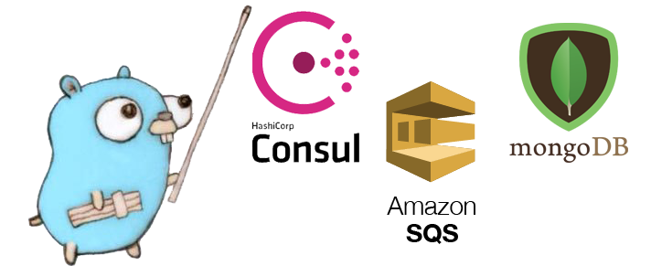
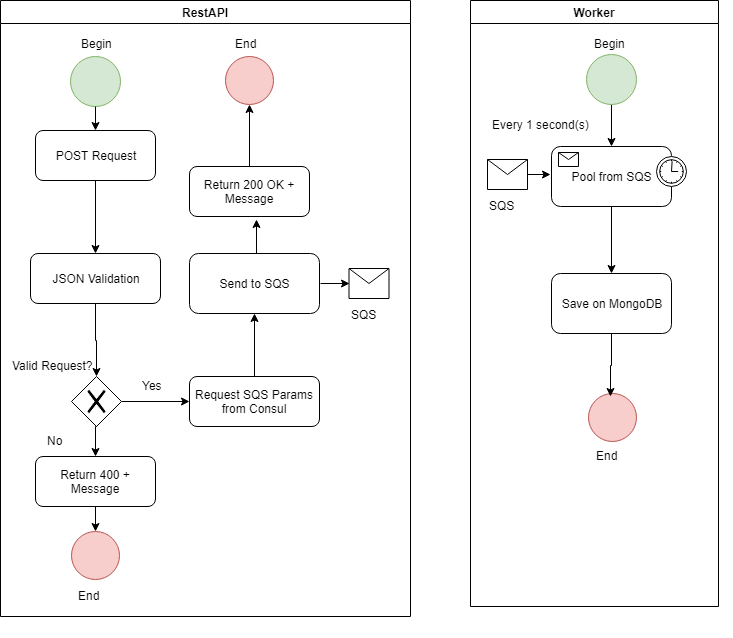

<p align="center"> 

</p>

# GO SQS API WORKER

## Descrição

Este exemplo mostra a utilização de uma API que envia dados para uma fila do AWS SQS, enquanto um worker alimenta o banco de dados.

## Linguagem

Foi escolhida a linguagem GO pela alta performance, simplicidade de leitura e poderoso recurso de concorrência com as goroutines.
Isso permite que mesmo que o worker demore mais tempo para processar um lote de mensagens de uma fila, uma nova goroutine será disparada
no tempo exato, sem atrapalhar o desempenho do sistema.

## Funcionalidades

*API*

* Coleta dados de sugestões por um endpoint HTTP utilizando método POST
* Busca dados da fila SQS em um serviço do Consul
* Envia dados para fila SQS
* Busca dados de um banco MongoDB
* Exibe os dados de pesquisa por um endpoint HTTP utilizando método GET

*WORKER*

* Busca dados da fila SQS em um serviço do Consul
* Busca a cada X segundos mensagens de uma fila SQS
* Armazena mensagens em um banco de dados MongoDB

*CONSUL*

* Recebe saída de dados do Terraform como input key value
* Disponibiliza valores através de endpoints HTTP pelo método GET

*MONGODB*

* Armazena informações das sugestões cadastradas

*TERRAFORM*

* Provisiona infraestrutura necessária para execução na AWS

Fluxo da Informação

<p align="center"> 

</p>

# Instalação

Este guia de instalação e execução presumime que você o esteja executando em um sistema operacional Linux atualizado, com a plataforma Docker instalada. Mais informações de como instalar o Docker no Linux, **[clique aqui](https://docs.docker.com/)**

Primeiramente crie os usuários do Terraform e da Aplicação com as seguintes permissões:

**Usuário do Terraform**

```
{
    "Version": "2012-10-17",
    "Statement": [
        {
            "Effect": "Allow",
            "Action": [
                "sqs:GetQueueUrl",
                "sqs:ChangeMessageVisibility",
                "sqs:SendMessageBatch",
                "sqs:UntagQueue",
                "s3:ListBucket",
                "sqs:GetQueueAttributes",
                "sqs:ListQueueTags",
                "s3:PutObject",
                "s3:GetObject",
                "sqs:TagQueue",
                "sqs:RemovePermission",
                "sqs:AddPermission",
                "sqs:DeleteMessageBatch",
                "sqs:PurgeQueue",
                "sqs:DeleteQueue",
                "sqs:CreateQueue",
                "sqs:ChangeMessageVisibilityBatch",
                "sqs:SetQueueAttributes"
            ],
            "Resource": [
                "arn:aws:s3:::exemplo-sqs-terraform/*",
                "arn:aws:s3:::exemplo-sqs-terraform",
                "arn:aws:sqs:*:*:exemplo-sqs-terraform.fifo"
            ]
        },
        {
            "Effect": "Allow",
            "Action": "sqs:ListQueues",
            "Resource": "*"
        }
    ]
}
```

Usuário da Aplicação

```
{
    "Version": "2012-10-17",
    "Statement": [
        {
            "Effect": "Allow",
            "Action": [
                "sqs:DeleteMessage",
                "sqs:DeleteMessage",
                "sqs:SendMessage",
                "ReceiveMessage"
            ],
            "Resource": [
                "arn:aws:sqs:*:*:exemplo-sqs-terraform.fifo"
            ]
        },
        {
            "Effect": "Allow",
            "Action": "sqs:ListQueues",
            "Resource": "*"
        }
    ]
}
```

Ao gerar o Access Key e Secret Access Key de cada conta, substitua os valores referentes nos arquivos **terraform-compose.yml** nos campos *ARG_AWS_ACCESS_KEY_ID* e *ARG_AWS_SECRET_ACCESS_KEY* e no arquivo **service-compose.yml** nos campos *AWS_ACCESS_KEY_ID* e *AWS_ACCESS_KEY_ID* dos serviços api e worker.

Caso queira alterar o comando do terraform, edite o arquivo **terraform-compose.yml**.

Crie um bucket no S3 com o mesmo nome definido na configuração do terraform backend do arquivo **terraform-compose.yml**.

Agora vamos colocar o sistema para funcionar!

```
make service
```

Com o comando acima, executaremos o docker-compose fazendo o build da API, Worker e um node do Consul. Somente o serviço do Worker falhará e forçando a reinicialização do mesmo. Isso se dá pois ainda não temos a fila do SQS e GroupID definidos como Key Value no Consul. A aplicação 
verifica se o endpoint definido existe e consome o valor que o Consul provê. 

```
make infra
```

Este comando iniciará o docker-compose de uma imagem do Terraform, ele executará os comandos definidos no terraform-compose.yml. Fique atento a definir as chaves com as permissões necessárias para criação das filas.
Após a execução do comando terraform apply padrão no arquivo, ele irá enviar os dados a URL da fila SQS e o GroupID das mensagens para a API do consul em endpoints definidos. Os serviços que antes não conseguiam subir, agora já fazem requisições a cada chamada. 


O comando abaixo para e remove os containers e as imagens criadas. Mas faça os testes antes! =)

```
make clean
```

# Testes

Nossa API estará ativa no endereço http://localhost:8080

Os endpoints existentes atualmente são:

```
GET - http://localhost:8080/v1/data
```

Este endpoint busca todas as sugestões cadastradas no banco de dados MongoDB

```
POST - http://localhost:8080/v1/data - application/json
```

Este endpoint envia as sugestões para uma fila SQS, o serviço do Worker fará o trabalho de inserção

**Template de requisição**

```
{
	"message": "sample-message",
	"user"   : "anon"
}
```

# Troubleshoot

**ERROR: for real_terraform_1  Cannot start service terraform: error while creating mount source path '/path/terraform/output': mkdir /host_mnt/c: file exists**

Em alguns casos utilizando o WSL, é necessário recriar a ligação entre host e containers no Docker for Desktop.
Para isso, clique com o botão direito no ícone do Docker na barra de tarefas, vá em *Settings* -> *Shared Drives* -> Desmarque as opções de compatilhamento de disco, clique em Apply, marque novamente as opções de compartilhamento, clique em Apply.

**Error inspecting states in the "s3" backend: AccessDenied: Access Denied**

Verifique se o caminho do bucket informado nas permissões do usuário do Terraform são os mesmos informados no arquivo **terraform/main.tf**